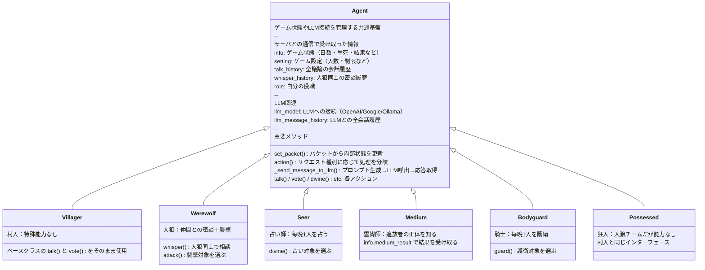
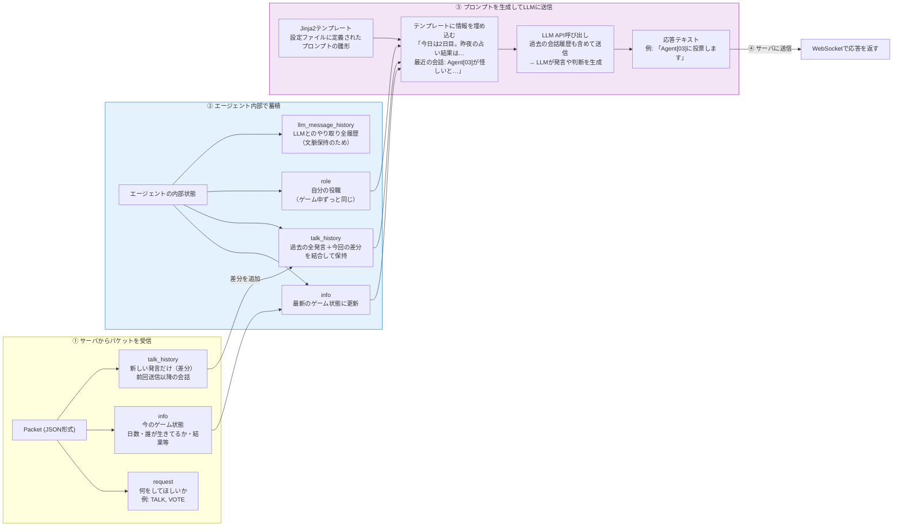
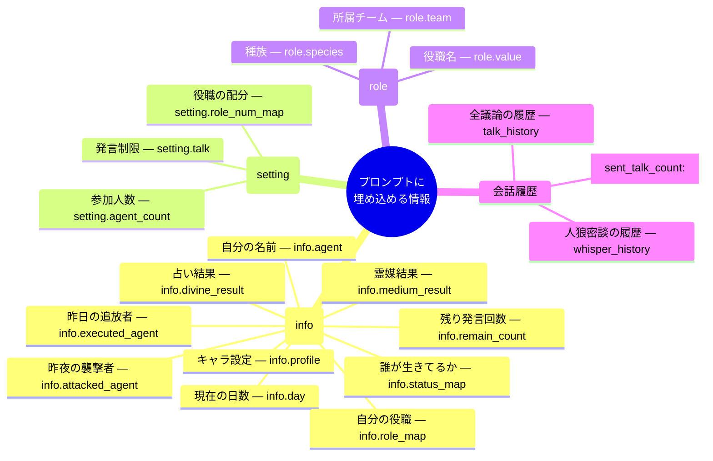
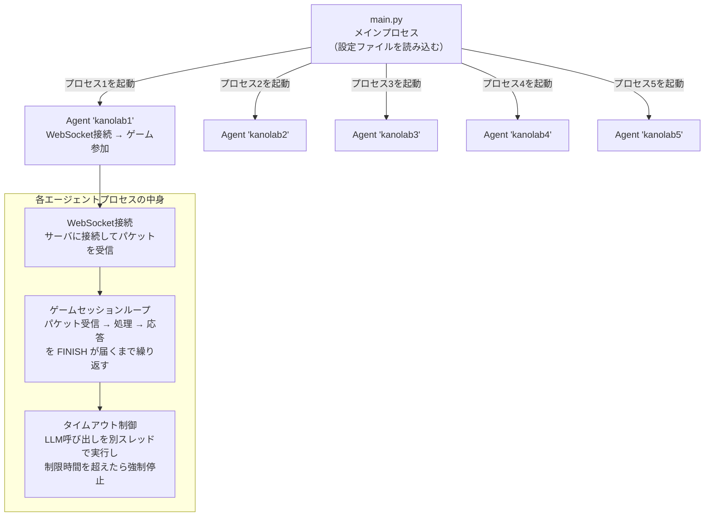
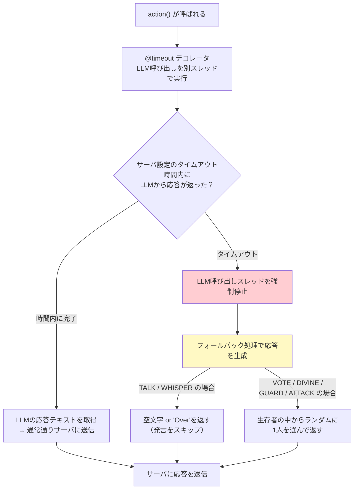

# エージェント内部アーキテクチャ

> このドキュメントでは、LLMエージェントの内部構造を説明します。エージェントがサーバからリクエストを受け取り、LLMに問い合わせ、応答を返すまでの流れを中心に解説します。

## エージェントの全体像

エージェントは「人狼ゲームのプレイヤー」です。自分では考えず、LLM（ChatGPTやGeminiなど）に状況を伝えて「何を発言すべきか」「誰に投票すべきか」を考えさせます。

エージェントの主な仕事は以下の3つです:
1. **サーバからの指示を受け取る** — 「発言して」「投票して」などのリクエスト
2. **LLMに状況を伝えて判断を仰ぐ** — ゲーム状態・会話履歴をプロンプトにまとめてLLM APIを呼び出す
3. **LLMの応答をサーバに返す** — 発言テキストや投票先をWebSocketで送信

## クラス階層

全ての役職は共通の `Agent` ベースクラスを継承しています。ベースクラスにLLM呼び出し・状態管理などの中核ロジックが集約されており、各役職クラスはその役職だけが使う特殊なアクション（占い・護衛・襲撃など）のメソッドをオーバーライドしています。



## データの流れ：サーバ → エージェント → LLM → サーバ

以下の図は、サーバからパケットを受信してからLLMに問い合わせて応答を返すまでの、エージェント内部のデータの流れを示しています。

**ポイント:**
- サーバからは毎回「差分」だけが送られてくる（新しい発言のみ）
- エージェント側で過去の履歴と結合して「全体」を保持する
- LLMには必要な情報だけをテンプレートで整形して送る



## プロンプトテンプレートの仕組み

LLMに送るプロンプトは、**設定ファイル（YAML）内にJinja2テンプレートとして定義**されています。エージェントは毎回のリクエストに対して、テンプレートにゲーム情報を埋め込んで最終的なプロンプト文字列を生成します。

### テンプレートで使える情報の全体像



### テンプレートの具体例

設定ファイルにはこのようなテンプレートが書かれています:

```yaml
prompt:
  # ゲーム開始時：LLMに役職とルールを伝える
  initialize: |
    あなたは人狼ゲームのエージェントです。
    あなたの名前は{{ info.agent }}です。
    あなたの役職は{{ role.value }}です。
    ...

  # 毎朝：前日の結果を伝える
  daily_initialize: |
    {{ info.day }}日目の昼になりました。
    占い結果: {{ info.divine_result }}
    昨日の追放: {{ info.executed_agent }}

  # 議論：最近の会話を見せて発言を求める
  talk: |
    発言してください。最近の会話:
    
    {{ w.agent }}: {{ w.text }}
    

  # 投票：生存者リストを見せて投票先を求める
  vote: |
    誰に投票しますか？ 候補:
    
    {{ k }}
    
```

**`sent_talk_count` の役割**: LLMに送る会話履歴の「どこまで送ったか」を記録するマーカーです。`talk_history[sent_talk_count:]` とすることで、前回のtalk()呼び出し以降に追加された新しい発言だけをLLMに伝えます。これにより、同じ会話を何度も送らずに済みます。

## マルチプロセス構成

エージェントは **複数の独立したプロセス** として起動します。各プロセスが1体のエージェントに対応し、それぞれが独自にサーバとWebSocket接続を持ちます。



## タイムアウト処理

LLM APIの応答が遅い場合に備えて、エージェントにはタイムアウト機構があります。サーバ側にも応答待ちのタイムアウトがあるため、エージェントはそれに間に合うように応答を返す必要があります。


