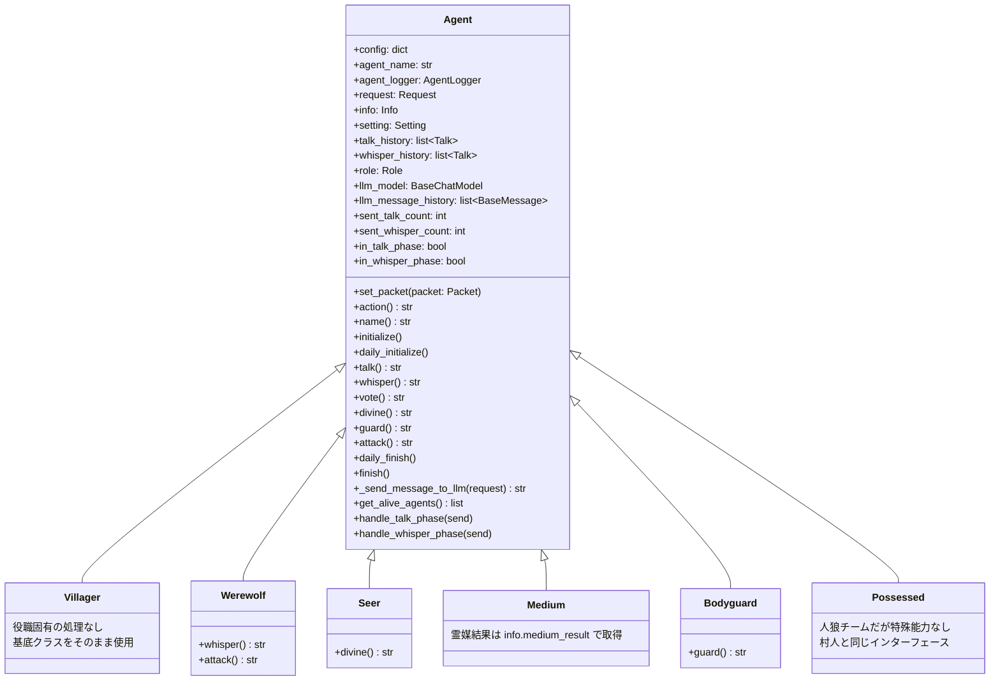
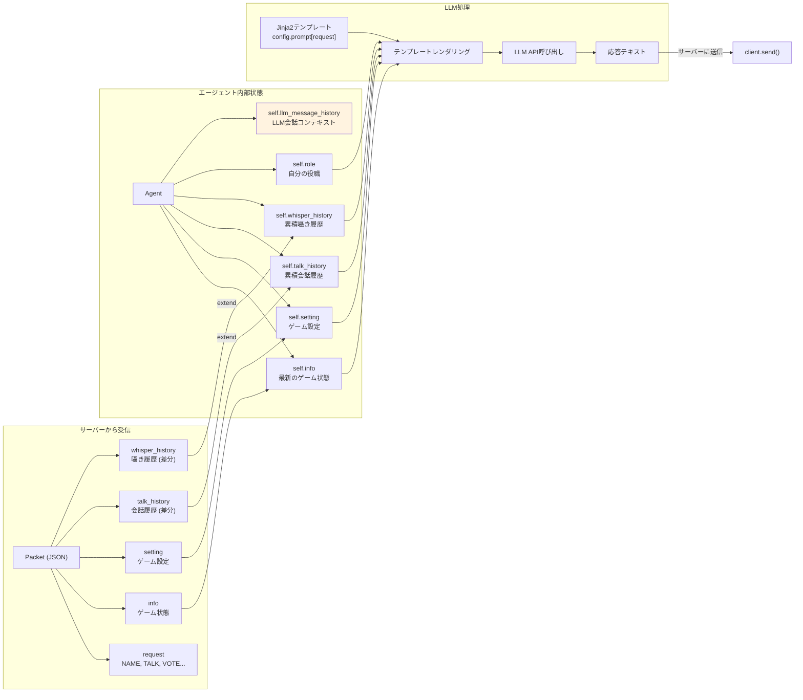
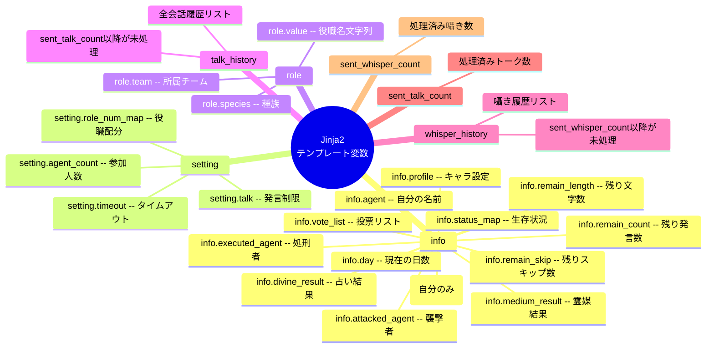
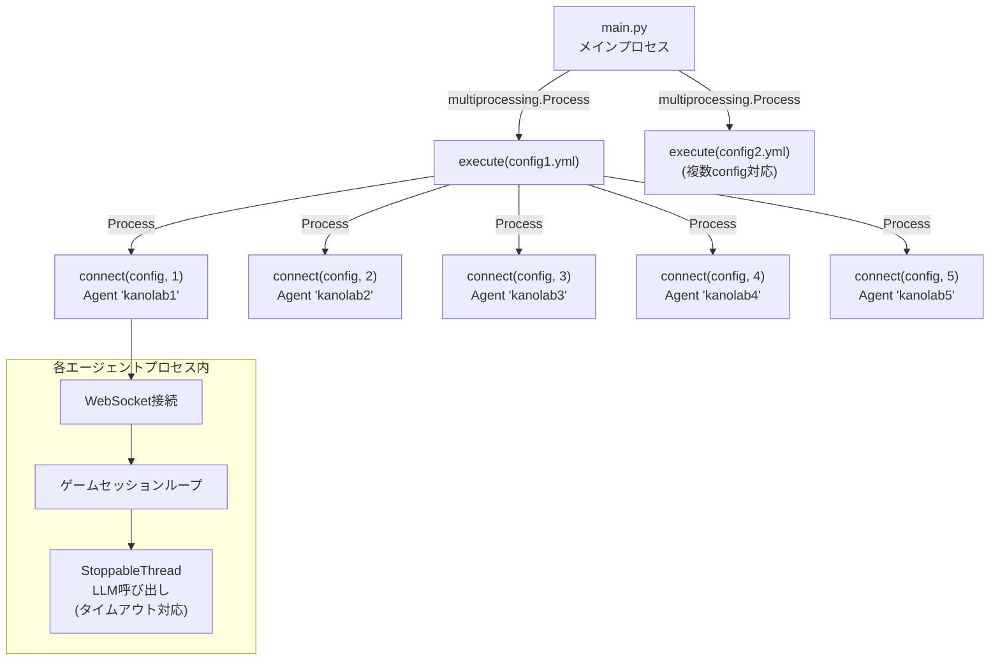
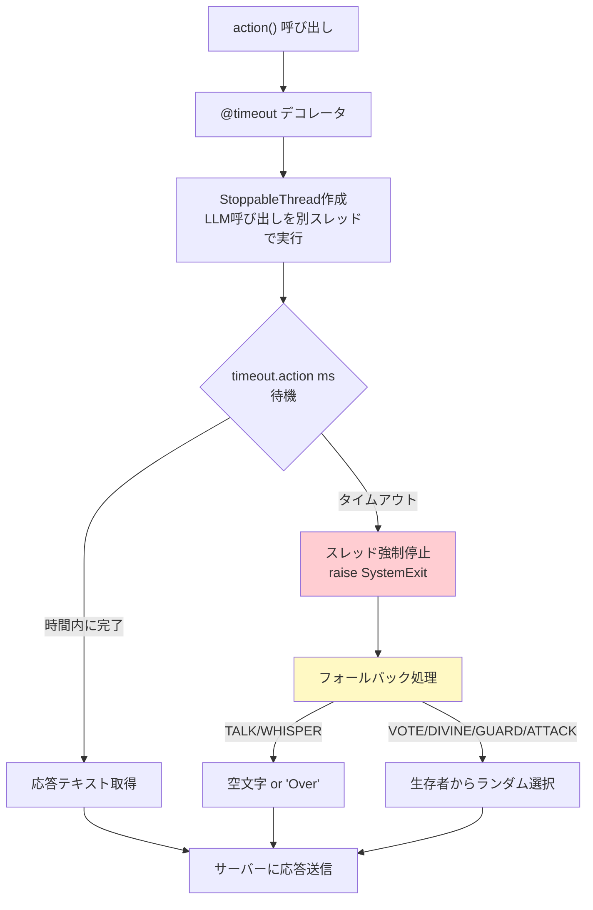

# エージェント内部アーキテクチャ

## クラス階層

```mermaid
classDiagram
    class Agent {
        +config: dict
        +agent_name: str
        +agent_logger: AgentLogger
        +request: Request
        +info: Info
        +setting: Setting
        +talk_history: list~Talk~
        +whisper_history: list~Talk~
        +role: Role
        +llm_model: BaseChatModel
        +llm_message_history: list~BaseMessage~
        +sent_talk_count: int
        +sent_whisper_count: int
        +in_talk_phase: bool
        +in_whisper_phase: bool
        +set_packet(packet: Packet)
        +action() str
        +name() str
        +initialize()
        +daily_initialize()
        +talk() str
        +whisper() str
        +vote() str
        +divine() str
        +guard() str
        +attack() str
        +daily_finish()
        +finish()
        +_send_message_to_llm(request) str
        +get_alive_agents() list
        +handle_talk_phase(send)
        +handle_whisper_phase(send)
    }

    class Villager {
        役職固有の処理なし
        基底クラスをそのまま使用
    }

    class Werewolf {
        +whisper() str
        +attack() str
    }

    class Seer {
        +divine() str
    }

    class Medium {
        霊媒結果は info.medium_result で取得
    }

    class Bodyguard {
        +guard() str
    }

    class Possessed {
        人狼チームだが特殊能力なし
        村人と同じインターフェース
    }

    Agent <|-- Villager
    Agent <|-- Werewolf
    Agent <|-- Seer
    Agent <|-- Medium
    Agent <|-- Bodyguard
    Agent <|-- Possessed
```

## データフロー

```mermaid
flowchart LR
    subgraph "サーバーから受信"
        Packet["Packet (JSON)"]
        Packet --> Request["request<br/>NAME, TALK, VOTE..."]
        Packet --> InfoData["info<br/>ゲーム状態"]
        Packet --> SettingData["setting<br/>ゲーム設定"]
        Packet --> TalkHist["talk_history<br/>会話履歴 (差分)"]
        Packet --> WhisperHist["whisper_history<br/>囁き履歴 (差分)"]
    end

    subgraph "エージェント内部状態"
        AgentState["Agent"]
        AgentState --> SelfInfo["self.info<br/>最新のゲーム状態"]
        AgentState --> SelfSetting["self.setting<br/>ゲーム設定"]
        AgentState --> SelfTalk["self.talk_history<br/>累積会話履歴"]
        AgentState --> SelfWhisper["self.whisper_history<br/>累積囁き履歴"]
        AgentState --> SelfRole["self.role<br/>自分の役職"]
        AgentState --> LLMHist["self.llm_message_history<br/>LLM会話コンテキスト"]
    end

    subgraph "LLM処理"
        Template["Jinja2テンプレート<br/>config.prompt[request]"]
        Render["テンプレートレンダリング"]
        LLMCall["LLM API呼び出し"]
        Response["応答テキスト"]

        Template --> Render
        SelfInfo & SelfSetting & SelfTalk & SelfWhisper & SelfRole --> Render
        Render --> LLMCall --> Response
    end

    InfoData --> SelfInfo
    SettingData --> SelfSetting
    TalkHist -->|extend| SelfTalk
    WhisperHist -->|extend| SelfWhisper
    Response -->|"サーバーに送信"| ServerSend["client.send()"]

    style LLMHist fill:#fff3e0
```

## プロンプトテンプレート変数マップ

```mermaid
mindmap
    root((Jinja2<br/>テンプレート変数))
        info
            info.agent -- 自分の名前
            info.day -- 現在の日数
            info.profile -- キャラ設定
            info.status_map -- 生存状況
            info.role_map -- 役職(自分のみ)
            info.divine_result -- 占い結果
            info.medium_result -- 霊媒結果
            info.executed_agent -- 処刑者
            info.attacked_agent -- 襲撃者
            info.vote_list -- 投票リスト
            info.remain_count -- 残り発言数
            info.remain_length -- 残り文字数
            info.remain_skip -- 残りスキップ数
        setting
            setting.agent_count -- 参加人数
            setting.role_num_map -- 役職配分
            setting.talk -- 発言制限
            setting.timeout -- タイムアウト
        role
            role.value -- 役職名文字列
            role.team -- 所属チーム
            role.species -- 種族
        talk_history
            全会話履歴リスト
            sent_talk_count以降が未処理
        whisper_history
            囁き履歴リスト
            sent_whisper_count以降が未処理
        sent_talk_count
            処理済みトーク数
        sent_whisper_count
            処理済み囁き数
```

## マルチプロセス構成

```mermaid
flowchart TD
    Main["main.py<br/>メインプロセス"]
    Main -->|"multiprocessing.Process"| E1["execute(config1.yml)"]
    Main -->|"multiprocessing.Process"| E2["execute(config2.yml)<br/>(複数config対応)"]

    E1 -->|"Process"| C1["connect(config, 1)<br/>Agent 'kanolab1'"]
    E1 -->|"Process"| C2["connect(config, 2)<br/>Agent 'kanolab2'"]
    E1 -->|"Process"| C3["connect(config, 3)<br/>Agent 'kanolab3'"]
    E1 -->|"Process"| C4["connect(config, 4)<br/>Agent 'kanolab4'"]
    E1 -->|"Process"| C5["connect(config, 5)<br/>Agent 'kanolab5'"]

    subgraph "各エージェントプロセス内"
        direction TB
        WS["WebSocket接続"]
        Loop["ゲームセッションループ"]
        Thread["StoppableThread<br/>LLM呼び出し<br/>(タイムアウト対応)"]

        WS --> Loop --> Thread
    end

    C1 --> WS
```

## タイムアウト処理

```mermaid
flowchart TD
    Action["action() 呼び出し"] --> Decorator["@timeout デコレータ"]
    Decorator --> CreateThread["StoppableThread作成<br/>LLM呼び出しを別スレッドで実行"]
    CreateThread --> Wait{"timeout.action ms<br/>待機"}

    Wait -->|"時間内に完了"| Success["応答テキスト取得"]
    Wait -->|"タイムアウト"| Kill["スレッド強制停止<br/>raise SystemExit"]
    Kill --> Fallback["フォールバック処理"]

    Fallback -->|"TALK/WHISPER"| SkipText["空文字 or 'Over'"]
    Fallback -->|"VOTE/DIVINE/GUARD/ATTACK"| Random["生存者からランダム選択"]

    Success --> Send["サーバーに応答送信"]
    SkipText --> Send
    Random --> Send

    style Kill fill:#ffcdd2
    style Fallback fill:#fff9c4
```
