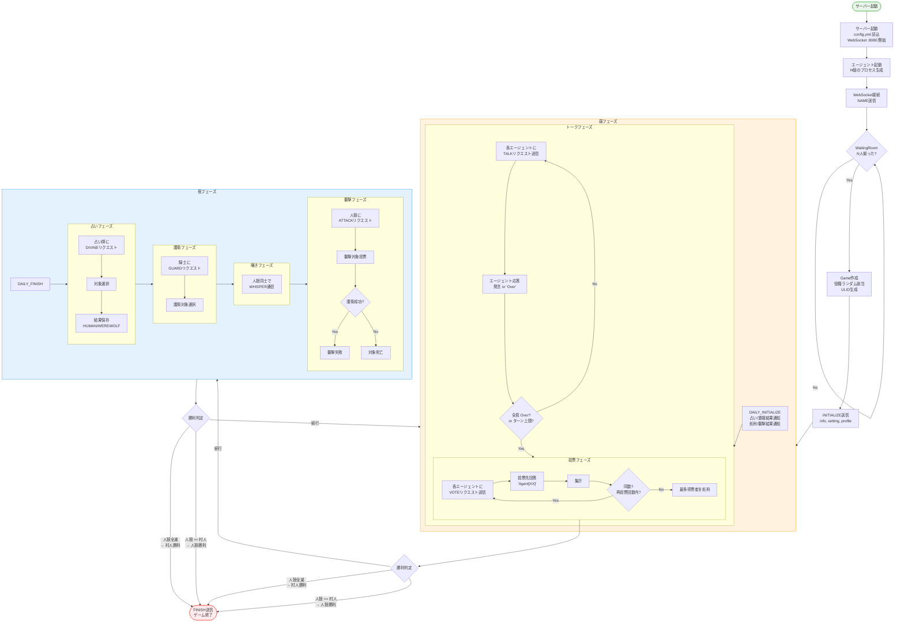
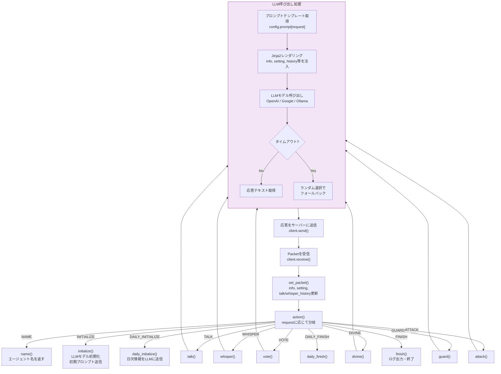
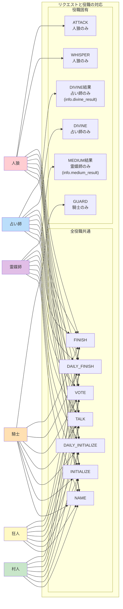
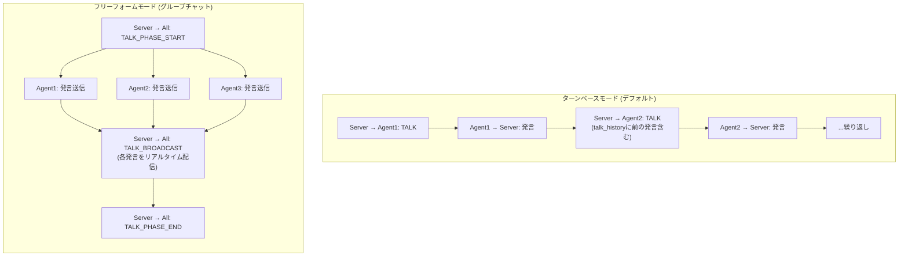

# ゲームフロー アーキテクチャ

## ゲーム全体フロー

```mermaid
flowchart TD
    Start([サーバー起動]) --> ServerStart["サーバー起動<br/>config.yml 読込<br/>WebSocket :8080 開始"]
    ServerStart --> AgentStart["エージェント起動<br/>N個のプロセス生成"]
    AgentStart --> Connect["WebSocket接続<br/>NAME送信"]
    Connect --> WaitingRoom{"WaitingRoom<br/>N人揃った?"}
    WaitingRoom -->|No| WaitingRoom
    WaitingRoom -->|Yes| CreateGame["Game作成<br/>役職ランダム割当<br/>ULID生成"]
    CreateGame --> Initialize["INITIALIZE送信<br/>info, setting, profile"]

    Initialize --> DayLoop

    subgraph DayLoop["昼フェーズ"]
        DI["DAILY_INITIALIZE<br/>占い/霊媒結果通知<br/>処刑/襲撃結果通知"]
        DI --> TalkPhase

        subgraph TalkPhase["トークフェーズ"]
            T1["各エージェントに<br/>TALKリクエスト送信"]
            T1 --> T2["エージェント応答<br/>発言 or 'Over'"]
            T2 --> T3{"全員 Over?<br/>or ターン上限?"}
            T3 -->|No| T1
            T3 -->|Yes| VotePhase
        end

        subgraph VotePhase["投票フェーズ"]
            V1["各エージェントに<br/>VOTEリクエスト送信"]
            V1 --> V2["投票先回答<br/>'Agent[XX]'"]
            V2 --> V3["集計"]
            V3 --> V4{"同数?<br/>再投票回数内?"}
            V4 -->|Yes| V1
            V4 -->|No| V5["最多得票者を処刑"]
        end
    end

    VotePhase --> WinCheck1{"勝利判定"}
    WinCheck1 -->|"人狼全滅<br/>→ 村人勝利"| GameEnd
    WinCheck1 -->|"人狼 >= 村人<br/>→ 人狼勝利"| GameEnd
    WinCheck1 -->|続行| NightLoop

    subgraph NightLoop["夜フェーズ"]
        DF["DAILY_FINISH"]

        DF --> DivinePhase
        subgraph DivinePhase["占いフェーズ"]
            D1["占い師に<br/>DIVINEリクエスト"]
            D1 --> D2["対象選択"]
            D2 --> D3["結果保存<br/>HUMAN/WEREWOLF"]
        end

        DivinePhase --> GuardPhase
        subgraph GuardPhase["護衛フェーズ"]
            G1["騎士に<br/>GUARDリクエスト"]
            G1 --> G2["護衛対象選択"]
        end

        GuardPhase --> WhisperPhase
        subgraph WhisperPhase["囁きフェーズ"]
            W1["人狼同士で<br/>WHISPER通信"]
        end

        WhisperPhase --> AttackPhase
        subgraph AttackPhase["襲撃フェーズ"]
            AT1["人狼に<br/>ATTACKリクエスト"]
            AT1 --> AT2["襲撃対象投票"]
            AT2 --> AT3{"護衛成功?"}
            AT3 -->|Yes| AT4["襲撃失敗"]
            AT3 -->|No| AT5["対象死亡"]
        end
    end

    NightLoop --> WinCheck2{"勝利判定"}
    WinCheck2 -->|"人狼全滅<br/>→ 村人勝利"| GameEnd
    WinCheck2 -->|"人狼 >= 村人<br/>→ 人狼勝利"| GameEnd
    WinCheck2 -->|続行| DayLoop

    GameEnd(["FINISH送信<br/>ゲーム終了"])

    style DayLoop fill:#fff3e0,stroke:#ff9800
    style NightLoop fill:#e3f2fd,stroke:#2196f3
    style GameEnd fill:#ffebee,stroke:#f44336
    style Start fill:#e8f5e9,stroke:#4caf50
```

## エージェント内部処理フロー

```mermaid
flowchart TD
    Recv["Packetを受信<br/>client.receive()"] --> SetPacket["set_packet()<br/>info, setting,<br/>talk/whisper_history更新"]
    SetPacket --> Dispatch["action()<br/>requestに応じて分岐"]

    Dispatch -->|NAME| Name["name()<br/>エージェント名を返す"]
    Dispatch -->|INITIALIZE| Init["initialize()<br/>LLMモデル初期化<br/>初期プロンプト送信"]
    Dispatch -->|DAILY_INITIALIZE| DailyInit["daily_initialize()<br/>日次情報をLLMに送信"]
    Dispatch -->|TALK| Talk["talk()"]
    Dispatch -->|WHISPER| Whisper["whisper()"]
    Dispatch -->|VOTE| Vote["vote()"]
    Dispatch -->|DIVINE| Divine["divine()"]
    Dispatch -->|GUARD| Guard["guard()"]
    Dispatch -->|ATTACK| Attack["attack()"]
    Dispatch -->|DAILY_FINISH| DailyFinish["daily_finish()"]
    Dispatch -->|FINISH| Finish["finish()<br/>ログ出力・終了"]

    Talk & Whisper & Vote & Divine & Guard & Attack --> LLMCall

    subgraph LLMCall["LLM呼び出し処理"]
        direction TB
        L1["プロンプトテンプレート取得<br/>config.prompt[request]"]
        L1 --> L2["Jinja2レンダリング<br/>info, setting, history等を注入"]
        L2 --> L3["LLMモデル呼び出し<br/>OpenAI / Google / Ollama"]
        L3 --> L4{"タイムアウト?"}
        L4 -->|No| L5["応答テキスト取得"]
        L4 -->|Yes| L6["ランダム選択で<br/>フォールバック"]
    end

    LLMCall --> Send["応答をサーバーに送信<br/>client.send()"]
    Send --> Recv

    style LLMCall fill:#f3e5f5,stroke:#9c27b0
```

## 役職別アクション対応表

```mermaid
graph LR
    subgraph "リクエストと役職の対応"
        direction TB

        subgraph "全役職共通"
            NAME[NAME]
            INIT[INITIALIZE]
            DI[DAILY_INITIALIZE]
            TALK[TALK]
            VOTE[VOTE]
            DF[DAILY_FINISH]
            FINISH[FINISH]
        end

        subgraph "役職固有"
            DIVINE["DIVINE<br/>占い師のみ"]
            GUARD["GUARD<br/>騎士のみ"]
            WHISPER["WHISPER<br/>人狼のみ"]
            ATTACK["ATTACK<br/>人狼のみ"]
            MEDIUM_R["MEDIUM結果<br/>霊媒師のみ<br/>(info.medium_result)"]
            DIVINE_R["DIVINE結果<br/>占い師のみ<br/>(info.divine_result)"]
        end
    end

    V[村人] --> NAME & INIT & DI & TALK & VOTE & DF & FINISH
    SE[占い師] --> NAME & INIT & DI & TALK & VOTE & DF & FINISH & DIVINE & DIVINE_R
    BD[騎士] --> NAME & INIT & DI & TALK & VOTE & DF & FINISH & GUARD
    ME[霊媒師] --> NAME & INIT & DI & TALK & VOTE & DF & FINISH & MEDIUM_R
    WW[人狼] --> NAME & INIT & DI & TALK & VOTE & DF & FINISH & WHISPER & ATTACK
    PO[狂人] --> NAME & INIT & DI & TALK & VOTE & DF & FINISH

    style V fill:#c8e6c9
    style SE fill:#bbdefb
    style BD fill:#ffe0b2
    style ME fill:#e1bee7
    style WW fill:#ffcdd2
    style PO fill:#fff9c4
```

## 通信モード比較

```mermaid
graph TB
    subgraph "ターンベースモード (デフォルト)"
        direction LR
        TB1["Server → Agent1: TALK"] --> TB2["Agent1 → Server: 発言"]
        TB2 --> TB3["Server → Agent2: TALK<br/>(talk_historyに前の発言含む)"]
        TB3 --> TB4["Agent2 → Server: 発言"]
        TB4 --> TB5["...繰り返し"]
    end

    subgraph "フリーフォームモード (グループチャット)"
        direction TB
        FF1["Server → All: TALK_PHASE_START"]
        FF1 --> FF2["Agent1: 発言送信"]
        FF1 --> FF3["Agent2: 発言送信"]
        FF1 --> FF4["Agent3: 発言送信"]
        FF2 & FF3 & FF4 --> FF5["Server → All: TALK_BROADCAST<br/>(各発言をリアルタイム配信)"]
        FF5 --> FF6["Server → All: TALK_PHASE_END"]
    end
```
