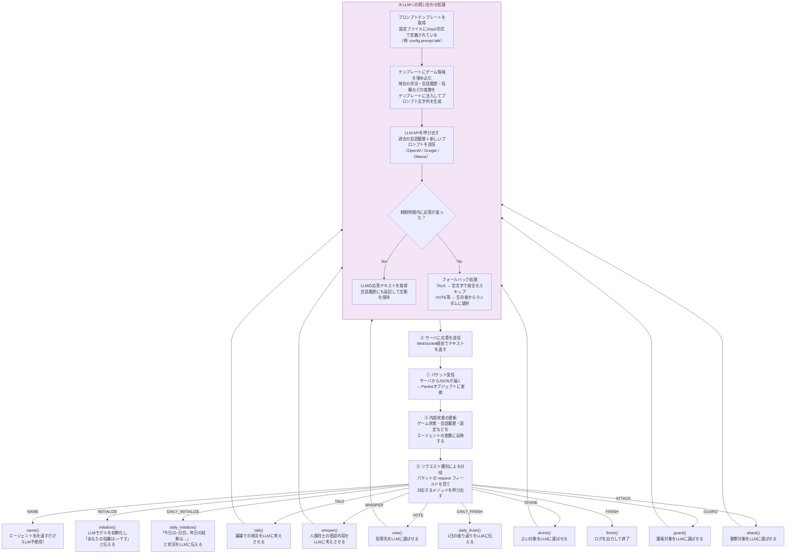
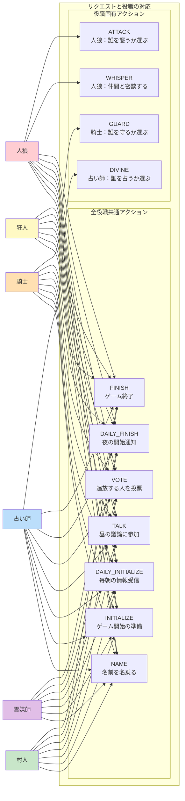
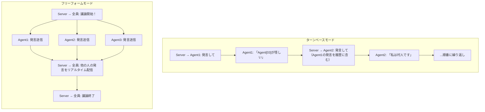

# ゲームフロー アーキテクチャ

> このドキュメントでは、AIWolf NLPシステムにおける1ゲームの流れを、**サーバ（Go）・エージェント（Python）・LLM（外部API）** の3つの登場人物の視点から説明します。各フェーズは背景色で区別しています。

## ゲーム全体フロー（Server / Agent / LLM の視点）

下図は、1ゲーム全体を **サーバ・エージェント・LLM** のやり取りとして描いたものです。
- 🟢 緑の背景 = 接続・初期化フェーズ
- 🟠 オレンジの背景 = 昼フェーズ（議論・投票）
- 🔵 青の背景 = 夜フェーズ（占い・護衛・囁き・襲撃）
- 🔴 赤の背景 = ゲーム終了

```mermaid
sequenceDiagram
    participant Agent as 🤖 Agent (Python)<br/>各エージェントプロセス
    participant Server as 🖥️ Server (Go)<br/>ゲーム進行管理
    participant LLM as 🧠 LLM API<br/>OpenAI / Google / Ollama

    rect rgb(232, 245, 233)
        Note over Agent, LLM: 【接続・初期化フェーズ】エージェントがサーバに接続し、ゲームが始まるまで

        Agent->>Server: WebSocket接続を確立<br/>（ws://host:8080/ws）
        Server->>Agent: 「名前を教えて」（NAMEリクエスト）
        Agent->>Server: 「kanolab1です」（エージェント名を返答）

        Note over Server: WaitingRoomで待機<br/>5人揃うまで他のエージェントの接続を待つ

        Note over Server: 5人揃った！<br/>役職をランダムに割り当て<br/>（例: 占い師1, 人狼1, 騎士1, 村人1, 狂人1）

        Server->>Agent: 「ゲーム開始！」（INITIALIZEパケット）<br/>あなたの役職・ゲーム設定・キャラ設定を送信
        Agent->>LLM: 「あなたは人狼ゲームの占い師です…」<br/>（初期化プロンプトを送信して役職を伝える）
        LLM-->>Agent: 「了解しました」
    end

    loop 毎日繰り返し（ゲーム終了まで）

        rect rgb(255, 243, 224)
            Note over Agent, LLM: 【昼フェーズ】議論して怪しい人を投票で追放する

            Server->>Agent: 「昼が始まりました」（DAILY_INITIALIZEパケット）<br/>前日の占い結果・霊媒結果・誰が死んだか等を通知
            Agent->>LLM: 「2日目の昼です。昨夜の結果は…」<br/>（状況をLLMに伝えて思考を促す）
            LLM-->>Agent: 「情報を整理します…」

            Note over Agent, Server: ── 議論フェーズ（TALK）──<br/>エージェントが順番に発言し、推理を共有する

            loop 全員が「Over」と言うか、ターン上限に達するまで
                Server->>Agent: 「発言してください」（TALKリクエスト）<br/>他のエージェントの発言履歴（差分）を添付
                Agent->>LLM: 「他の人の発言はこうでした。何か言いますか？」<br/>（会話履歴をもとにプロンプトを生成）
                LLM-->>Agent: 「Agent[03]の発言は矛盾しています」
                Agent->>Server: 「Agent[03]の発言は矛盾しています」<br/>（LLMの応答をそのまま送信）
            end

            Note over Agent, Server: ── 投票フェーズ（VOTE）──<br/>最も怪しいと思う人に投票し、多数決で追放

            Server->>Agent: 「誰に投票しますか？」（VOTEリクエスト）<br/>生存エージェント一覧を送信
            Agent->>LLM: 「投票先を選んでください。候補は…」
            LLM-->>Agent: 「Agent[03]」
            Agent->>Server: 「Agent[03]」

            Note over Server: 投票を集計<br/>最多得票者を追放（同数なら再投票）<br/>→ Agent[03]が追放される
        end

        rect rgb(187, 222, 251)
            Note over Agent, LLM: 【夜フェーズ】特殊能力を持つ役職が秘密裏に行動する

            Server->>Agent: 「夜が来ました」（DAILY_FINISHパケット）

            Note over Agent, Server: ── 占いフェーズ（DIVINE）──<br/>占い師だけが対象を選び、人狼かどうかを知る

            Server->>Agent: 「誰を占いますか？」（占い師のみに送信）
            Agent->>LLM: 「占い対象を選んでください」
            LLM-->>Agent: 「Agent[02]」
            Agent->>Server: 「Agent[02]」
            Note over Server: Agent[02]の正体を判定<br/>→ 結果（人狼 or 人間）を保存<br/>→ 翌朝の情報に含めて占い師に通知

            Note over Agent, Server: ── 護衛フェーズ（GUARD）──<br/>騎士だけが誰かを守り、襲撃から救える

            Server->>Agent: 「誰を護衛しますか？」（騎士のみに送信）
            Agent->>LLM: 「護衛対象を選んでください」
            LLM-->>Agent: 「Agent[01]」
            Agent->>Server: 「Agent[01]」

            Note over Agent, Server: ── 囁きフェーズ（WHISPER）──<br/>人狼同士だけが密談し、襲撃先を相談する

            Server->>Agent: 「人狼同士で話し合ってください」（人狼のみに送信）
            Agent->>LLM: 「仲間の人狼と相談：誰を襲撃する？」
            LLM-->>Agent: 「Agent[01]を狙おう」
            Agent->>Server: 「Agent[01]を狙おう」

            Note over Agent, Server: ── 襲撃フェーズ（ATTACK）──<br/>人狼が襲撃先を投票で決定する

            Server->>Agent: 「誰を襲撃しますか？」（人狼のみに送信）
            Agent->>LLM: 「襲撃対象を選んでください」
            LLM-->>Agent: 「Agent[01]」
            Agent->>Server: 「Agent[01]」
            Note over Server: 護衛対象と襲撃対象を照合<br/>一致 → 襲撃失敗（護衛成功！）<br/>不一致 → 対象が死亡
        end

        Note over Server: 【勝利判定】<br/>人狼が全滅 → 村人陣営の勝利<br/>人狼 ≥ 村人 → 人狼陣営の勝利<br/>どちらでもない → 翌日へ続行

    end

    rect rgb(255, 235, 238)
        Note over Agent, LLM: 【ゲーム終了】

        Server->>Agent: 「ゲーム終了！」（FINISHパケット）<br/>全員の役職が公開される
        Note over Agent: ログを出力して接続を閉じる
    end
```

## エージェント内部の処理フロー

エージェントがサーバからリクエストを受け取ったとき、内部でどのような処理が行われるかを示します。

**処理の流れ:**
1. サーバからJSON形式のパケットを受信し、Pythonオブジェクトに変換
2. パケットの中身（ゲーム状態・会話履歴など）をエージェントの内部状態に反映
3. リクエストの種類に応じて、適切なアクションメソッドを呼び出す
4. LLMへの問い合わせが必要な場合は、プロンプトを生成してAPIを呼び出す
5. LLMの応答をサーバに返送する

## 役職別アクション対応表

人狼ゲームには6つの役職があり、それぞれが使えるアクション（サーバから届くリクエストの種類）が異なります。

| 役職 | チーム | 特徴 | 固有アクション |
|------|--------|------|---------------|
| **村人** | 村人陣営 | 特殊能力なし。議論と投票で人狼を見つける | なし |
| **占い師** | 村人陣営 | 毎晩1人を占い、人狼かどうかを知ることができる | DIVINE（占い結果を翌朝受け取る） |
| **騎士** | 村人陣営 | 毎晩1人を護衛し、人狼の襲撃から守れる | GUARD |
| **霊媒師** | 村人陣営 | 追放された人が人狼だったか翌朝わかる | なし（info.medium_resultで結果を受け取る） |
| **人狼** | 人狼陣営 | 毎晩1人を襲撃できる。人狼同士で密談もできる | WHISPER, ATTACK |
| **狂人** | 人狼陣営 | 人狼チームだが占いでは「人間」と出る。特殊能力なし | なし |

## 通信モード比較

サーバとエージェント間の議論（TALK/WHISPER）には2つの通信モードがあります。

### ターンベースモード（デフォルト）
エージェントが **1人ずつ順番に** 発言するモードです。サーバが各エージェントに順番にTALKリクエストを送り、前の人の発言を含む履歴を添付します。全員が「Over」（もう話すことがない）と言うか、ターン上限に達するまで繰り返します。

### フリーフォームモード（グループチャット）
全エージェントが **同時に自由に** 発言できるモードです。サーバが「議論開始」を通知すると、各エージェントは5秒間隔でLLMに問い合わせて発言を送信します。サーバは受信した発言を即座に全員にブロードキャストします。

