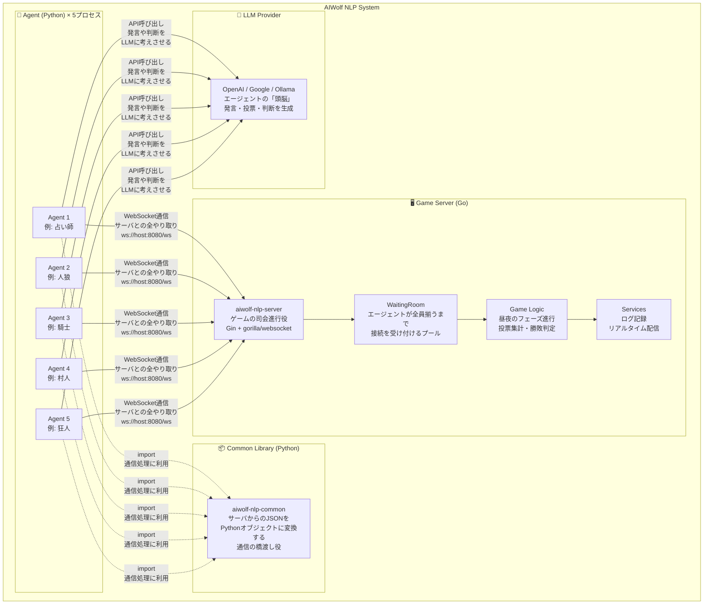
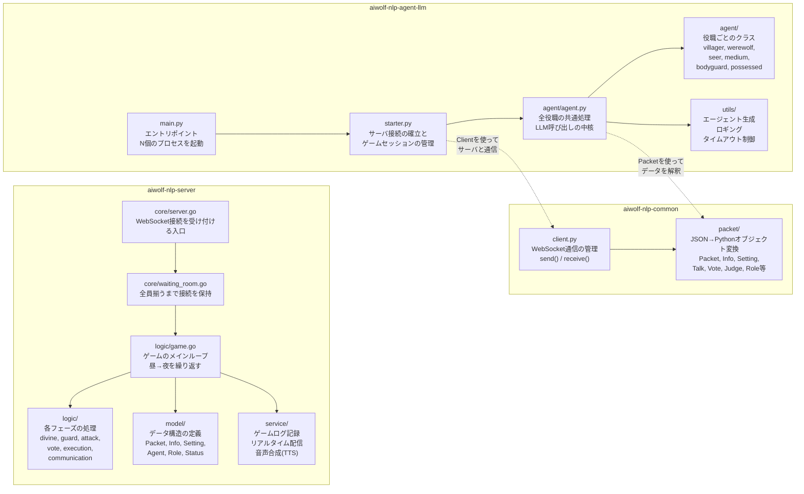
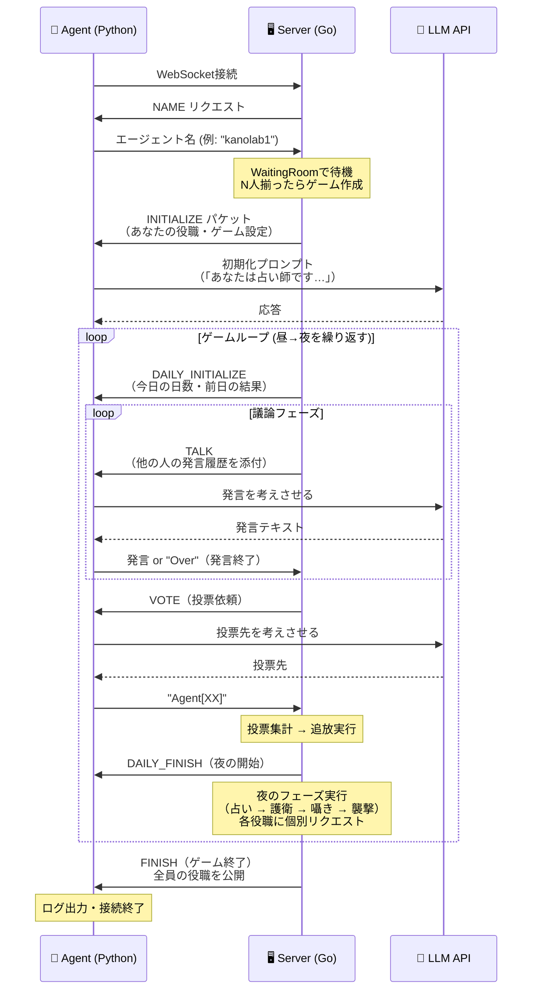
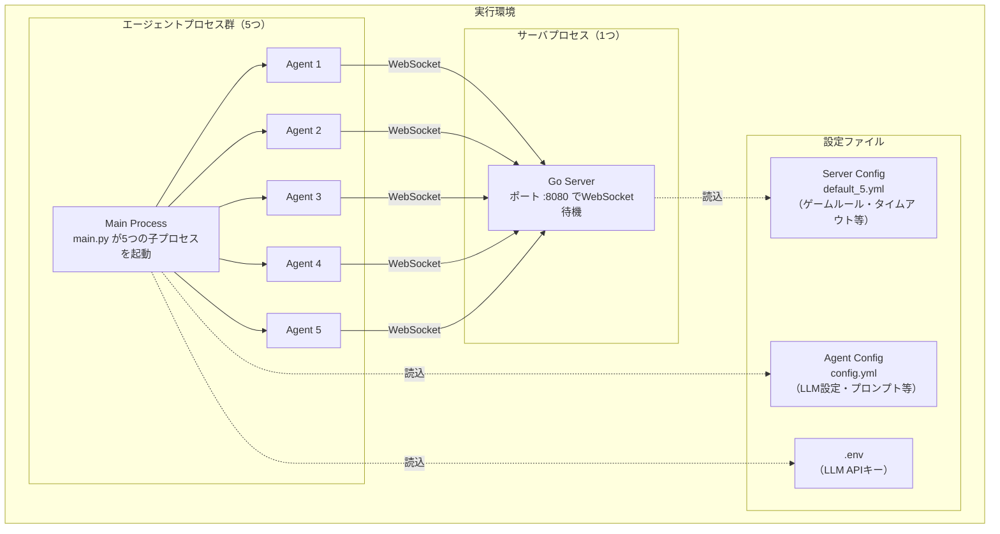

# システム全体アーキテクチャ

> このドキュメントでは、AIWolf NLPシステムを構成する3つのコンポーネントの役割と関係を、初めてシステムを見る人が直感的に理解できるよう説明します。

## システムの概要

AIWolf NLPシステムは、**LLM（大規模言語モデル）を使ったAIエージェント同士が人狼ゲームを対戦するためのプラットフォーム**です。

システムは以下の3つのコンポーネントで構成されています:

| コンポーネント | 役割の一言説明 | 言語 |
|---|---|---|
| **aiwolf-nlp-server** | ゲームの進行を管理する「ゲームマスター」 | Go |
| **aiwolf-nlp-agent-llm** | LLMを使って人狼ゲームをプレイする「プレイヤー」 | Python |
| **aiwolf-nlp-common** | サーバとエージェント間の通信を橋渡しする「通訳」 | Python |

## システム構成図

## 各コンポーネントの役割

### aiwolf-nlp-server（ゲームサーバ）

ゲーム全体の司会進行を担当します。具体的には:
- エージェントのWebSocket接続を受け付け、全員が揃うまで待機する
- 役職をランダムに割り当ててゲームを開始する
- 昼（議論→投票→追放）と夜（占い→護衛→囁き→襲撃）のフェーズを順番に進行する
- 各エージェントにリクエストを送信し、応答を待つ（タイムアウト管理つき）
- 勝利条件を判定してゲームを終了する

### aiwolf-nlp-agent-llm（LLMエージェント）

LLMを頭脳として使い、人狼ゲームをプレイする「プレイヤー」です:
- 5つの独立したプロセスとして起動し、それぞれがサーバに接続する
- サーバからリクエスト（「発言して」「投票して」等）が届くたびに、ゲーム状況をLLMに伝えて応答を生成する
- 割り当てられた役職に応じて、占い・護衛・襲撃などの固有アクションも実行する
- LLMとの会話履歴をゲーム全体で保持し、文脈のある発言・判断を行う

### aiwolf-nlp-common（共通ライブラリ）

サーバ（Go）とエージェント（Python）の間の通信プロトコルを抽象化する「通訳」です:
- WebSocket接続の確立・管理を行う（`Client`クラス）
- サーバから送られてくるJSON形式のパケットをPythonのデータクラスに変換する
- エージェントがサーバにテキストを送信するインターフェースを提供する

## コンポーネント関係図（ファイルレベル）

各コンポーネントの主要ファイルがどのように連携しているかを示します。

## 通信プロトコル（1ゲームの流れ）

サーバとエージェント間の通信は **WebSocket** で行われ、データは **JSON形式** でやり取りされます。

- **サーバ → エージェント**: JSON形式のパケット（リクエスト種別 + ゲーム状態 + 会話履歴）
- **エージェント → サーバ**: テキスト文字列（発言内容 or エージェント名）

## デプロイ構成

実際にシステムを動かすときの構成です。1台のマシン上でサーバとエージェントの両方を起動します。

