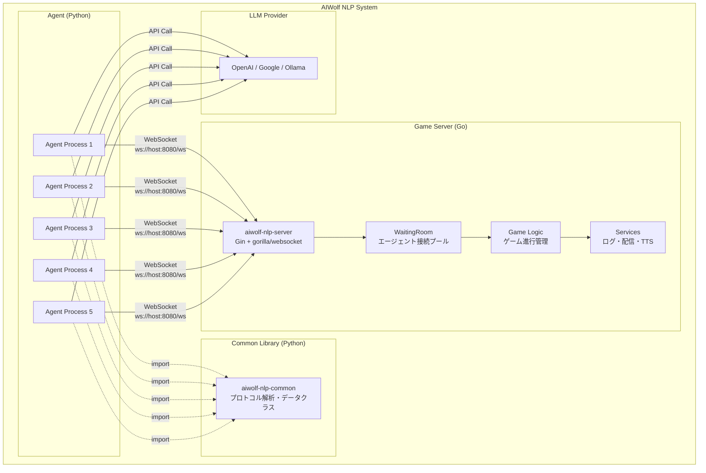
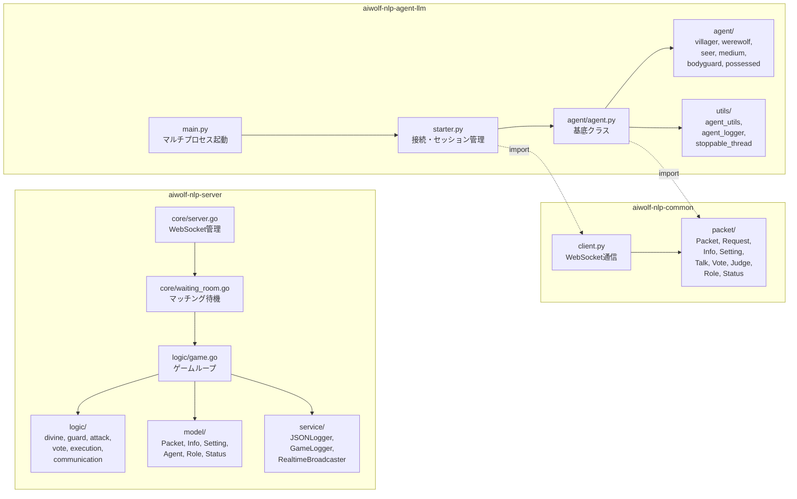
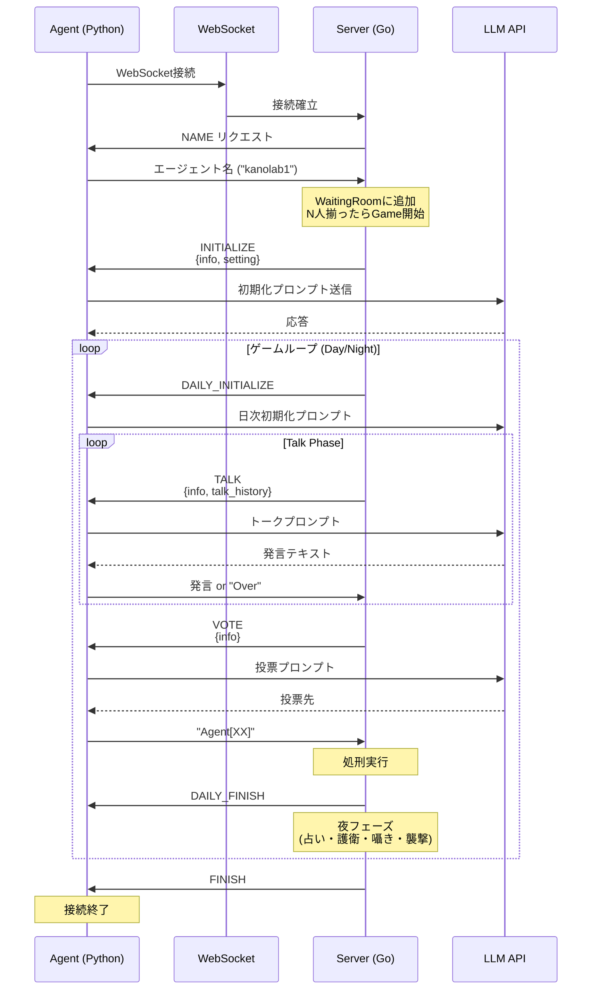
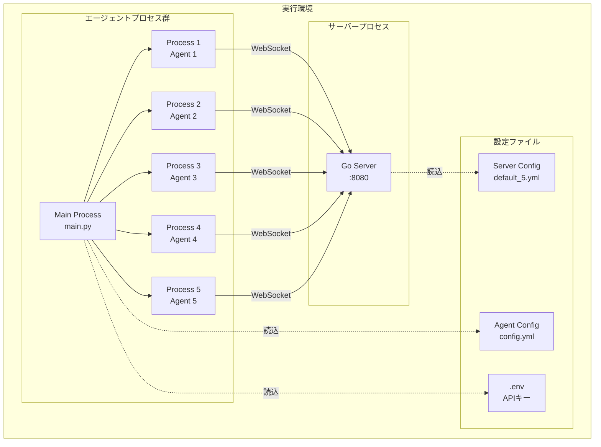

# システム全体アーキテクチャ

## システム構成図

```mermaid
graph TB
    subgraph "AIWolf NLP System"
        subgraph "Game Server (Go)"
            S[aiwolf-nlp-server<br/>Gin + gorilla/websocket]
            WR[WaitingRoom<br/>エージェント接続プール]
            GL[Game Logic<br/>ゲーム進行管理]
            SV[Services<br/>ログ・配信・TTS]
        end

        subgraph "Agent (Python)"
            A1[Agent Process 1]
            A2[Agent Process 2]
            A3[Agent Process 3]
            A4[Agent Process 4]
            A5[Agent Process 5]
        end

        subgraph "Common Library (Python)"
            CL[aiwolf-nlp-common<br/>プロトコル解析・データクラス]
        end

        subgraph "LLM Provider"
            LLM[OpenAI / Google / Ollama]
        end
    end

    A1 & A2 & A3 & A4 & A5 -->|WebSocket<br/>ws://host:8080/ws| S
    S --> WR --> GL
    GL --> SV
    A1 & A2 & A3 & A4 & A5 -.->|import| CL
    A1 & A2 & A3 & A4 & A5 -->|API Call| LLM
```

## コンポーネント関係図

```mermaid
graph LR
    subgraph "aiwolf-nlp-server"
        direction TB
        Server["core/server.go<br/>WebSocket管理"]
        WaitingRoom["core/waiting_room.go<br/>マッチング待機"]
        Game["logic/game.go<br/>ゲームループ"]
        Phases["logic/<br/>divine, guard, attack,<br/>vote, execution,<br/>communication"]
        Models["model/<br/>Packet, Info, Setting,<br/>Agent, Role, Status"]
        Services["service/<br/>JSONLogger,<br/>GameLogger,<br/>RealtimeBroadcaster"]

        Server --> WaitingRoom --> Game --> Phases
        Game --> Models
        Game --> Services
    end

    subgraph "aiwolf-nlp-common"
        direction TB
        Client["client.py<br/>WebSocket通信"]
        Packet["packet/<br/>Packet, Request,<br/>Info, Setting,<br/>Talk, Vote, Judge,<br/>Role, Status"]

        Client --> Packet
    end

    subgraph "aiwolf-nlp-agent-llm"
        direction TB
        Main["main.py<br/>マルチプロセス起動"]
        Starter["starter.py<br/>接続・セッション管理"]
        AgentBase["agent/agent.py<br/>基底クラス"]
        Roles["agent/<br/>villager, werewolf,<br/>seer, medium,<br/>bodyguard, possessed"]
        Utils["utils/<br/>agent_utils,<br/>agent_logger,<br/>stoppable_thread"]

        Main --> Starter --> AgentBase --> Roles
        AgentBase --> Utils
    end

    Starter -.->|import| Client
    AgentBase -.->|import| Packet
```

## 通信プロトコル

```mermaid
sequenceDiagram
    participant Agent as Agent (Python)
    participant WS as WebSocket
    participant Server as Server (Go)
    participant LLM as LLM API

    Agent->>WS: WebSocket接続
    WS->>Server: 接続確立

    Server->>Agent: NAME リクエスト
    Agent->>Server: エージェント名 ("kanolab1")

    Note over Server: WaitingRoomに追加<br/>N人揃ったらGame開始

    Server->>Agent: INITIALIZE<br/>{info, setting}
    Agent->>LLM: 初期化プロンプト送信
    LLM-->>Agent: 応答

    loop ゲームループ (Day/Night)
        Server->>Agent: DAILY_INITIALIZE
        Agent->>LLM: 日次初期化プロンプト

        loop Talk Phase
            Server->>Agent: TALK<br/>{info, talk_history}
            Agent->>LLM: トークプロンプト
            LLM-->>Agent: 発言テキスト
            Agent->>Server: 発言 or "Over"
        end

        Server->>Agent: VOTE<br/>{info}
        Agent->>LLM: 投票プロンプト
        LLM-->>Agent: 投票先
        Agent->>Server: "Agent[XX]"

        Note over Server: 処刑実行

        Server->>Agent: DAILY_FINISH

        Note over Server: 夜フェーズ<br/>(占い・護衛・囁き・襲撃)
    end

    Server->>Agent: FINISH
    Note over Agent: 接続終了
```

## デプロイ構成

```mermaid
graph TB
    subgraph "実行環境"
        subgraph "サーバープロセス"
            GoServer["Go Server<br/>:8080"]
        end

        subgraph "エージェントプロセス群"
            MP[Main Process<br/>main.py]
            MP --> P1[Process 1<br/>Agent 1]
            MP --> P2[Process 2<br/>Agent 2]
            MP --> P3[Process 3<br/>Agent 3]
            MP --> P4[Process 4<br/>Agent 4]
            MP --> P5[Process 5<br/>Agent 5]
        end

        subgraph "設定ファイル"
            SC[Server Config<br/>default_5.yml]
            AC[Agent Config<br/>config.yml]
            ENV[.env<br/>APIキー]
        end
    end

    GoServer -.->|読込| SC
    MP -.->|読込| AC
    MP -.->|読込| ENV
    P1 & P2 & P3 & P4 & P5 -->|WebSocket| GoServer
```
